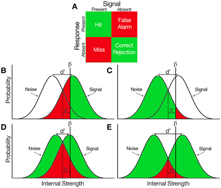

### Algunas apps para repasar conceptos básicos

¿Cómo encuentran la mejor recta?

https://gallery.shinyapps.io/simple_regression/

http://shinyapps.org/showapp.php?app=http://lmpp10e-mucesm.srv.mwn.de:3838/felix/lmfit&by=Felix%20Schönbrodt&title=Find-a-fit!&shorttitle=Find-a-fit!

## Prueba de hipótesis

http://shiny.stat.calpoly.edu/t_Test/

$$familywise error = 1 − 0.95^n$$

## Teoría de detección de señales

* Presentación de Felisa

**Resumen:**

http://journal.frontiersin.org/article/10.3389/fpsyg.2015.00762/full

https://apps4teaching.shinyapps.io/SignalDetection/
http://shiny.albany.edu/stat/betaprob/

## Aplicado a estadística

http://shiny.albany.edu/stat/betaprob/

## Implicaciones en investigación

http://shinyapps.org/apps/p-hacker/