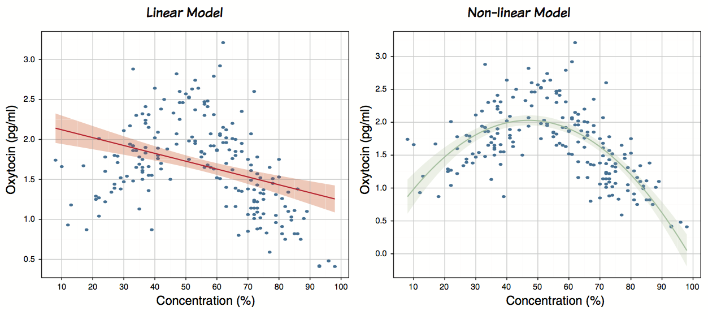
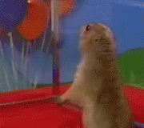
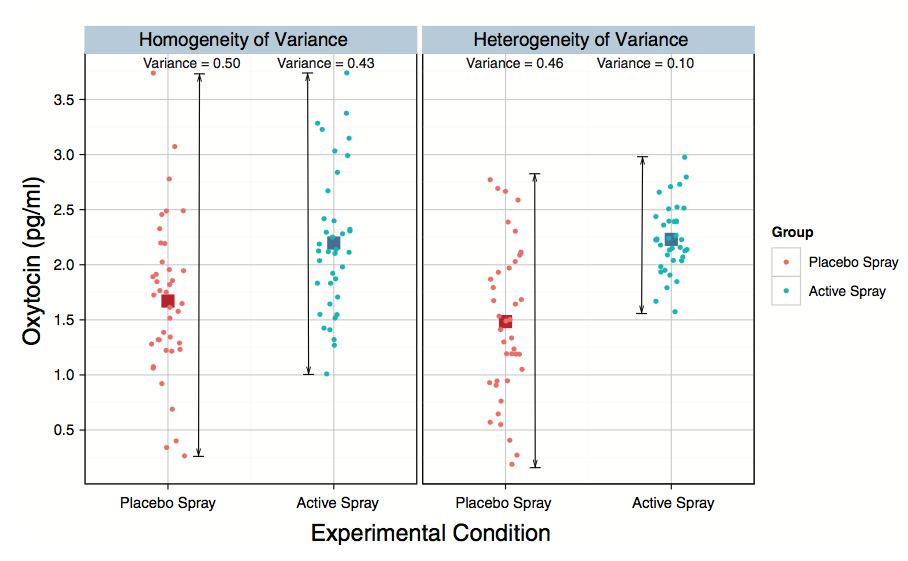
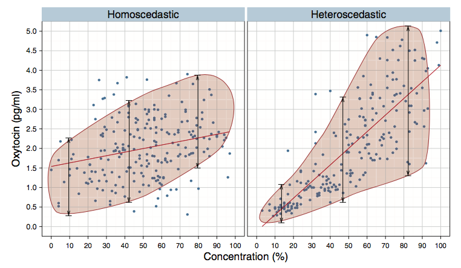

```{r setup, include=FALSE}
knitr::opts_chunk$set(message = FALSE)
```

## Predicción y residuales

```{r}
library(tidyverse)
ox_ob <- read.csv("oxitocina-observacion.csv" )
ox_ob <- mutate(ox_ob, Oxitocina = Oxytocin, Concentracion = Concentration) %>% 
         select(ID, Concentracion, Oxitocina)
mod_ox_ob <- lm(Oxitocina ~ Concentracion, data = ox_ob)
ox_ob$prediccion <- predict(mod_ox_ob)
ox_ob$residuales <- residuals(mod_ox_ob)

head(ox_ob)
```

```{r}
knitr::kable(ox_ob)
```


```{r}
ggplot(ox_ob, aes(x = Concentracion, y = Oxitocina)) +
  geom_point() +
  theme_bw()

ggplot(ox_ob, aes(x = Concentracion, y = Oxitocina)) +
  geom_point() +
  geom_smooth(method = "lm", se = FALSE) +
  theme_bw()


ggplot(ox_ob, aes(x = Concentracion, y = Oxitocina)) +
  geom_smooth(method = "lm", se = FALSE, color = "lightblue") +
  geom_segment(aes(xend = Concentracion, yend = prediccion), alpha = .7) +
  geom_point(aes(color = residuales), size = 2) + 
  scale_color_gradient2(low = "blue", mid = "white", high = "red") +  
  guides(color = FALSE) +
  geom_point(aes(y = prediccion), shape = 1, size = 2) +
  theme_bw()

ggplot(ox_ob, aes(x = Concentracion, y = Oxitocina)) +
  geom_point() +
  geom_smooth(method = "loess", se = FALSE) +
  theme_bw()
```


## Aditividad y linealidad



El supuesto de aditividad y linealidad es el más importante, porque es el supuesto de que el proceso del mundo real que quieres modelar puede ser capturado por la ecuación lineal.
**Linealidad** se refiere a asumir que la variable respuesta está linealmente relacionada a un predictor en particular (i.e., su relación puede ser capturada por una *línea recta*); mientras que **aditividad** se refiere al supuesto de que si tienes varios preddictores, entonces su efecto combinado es bien descrito *sumando* sus efectos. En otras palabras, significa que el proceso de interés es descrito con precisión por la siguiente ecuación.

$$variable \space respuesta_i = (b_0 + b_1X_{1i} + b_2X_{2i} + ... + b_nX_{ni})$$

Si el proceso no sigue un patrón lineal, estás ajustando el modelo incorrecto.

#### ¿Cómo lo pruebo?

Gráficamente

```{r}
library(ggplot2)
library(datasauRus)
ggplot(datasaurus_dozen, aes(x = x, y = y, colour = dataset))+
  geom_point()+
  geom_smooth(method = "lm", se = FALSE) +
  theme(legend.position = "none")+
  facet_wrap(~dataset, ncol=3) +
  theme_minimal()
```

## Independencia de los errores

Este supuesto implica que el $error_i$ para cada sujeto en la ecuación anterior no están relacionado uno con otro. Imagina que tu 'crush' (lo denominaremos **C**) y tú participan en una investigación donde tienen que calificar cuánto les gusta una lista de canciones. Si les preguntamos estando juntos es muy probable que las calificaciones que den no sean independientes: Tú respuesta a cada cacnción dependerá de lo que responda 'C'. Sabemos que si intentamos predecir tus respuestas va a haber un error en las predicciones que hagamos. Crucialmente, debido a que tus respuestas y las de 'C' no son independientes, los errores (residuales) asociados tampoco lo serán; están violando el supuesto.

Ahoa imagina un escenario diferente: el investigador es más precavido y antes de pedirles calificar las canciones les coloca audífonos a prueba de sonido y los pone en dos habitaciones separadas. En este caso tus respuestas no se verían afectadas por las respuestas de 'C', por lo que su error debería de ser independiente: el error en predecir tus respuestas no debería ser influenciad por las respuestas de 'C'. 

Genial... ¿Pero eso qué?

Es importante porque el cálculo del *error estándar* (la manera en que calculamos el error en un modelo) sólo es válida si las muestras son independientes y esta medida es utilizada para calacular los estadísticos y los intervalos de confianza: por lo que puede causar errores de inferencia en "cascada".

#### ¿Cómo lo pruebo?

```{r}
library(car)
modelo <- lm(mpg ~ disp + hp + wt + drat, data = mtcars)
durbinWatsonTest(modelo)
```

Poner especial atención en la autocorrelación y el valor p.

Mis datos están autocorrelacionados ¿Qué hago?

 <center></center>

La vida será más complicada y tendras que hacer uso de un tipo más avanzado de modelos conocidos como [modelos multinivel](https://es.wikipedia.org/wiki/Modelo_multinivel).

## Homosedasticidad



En un diseño donde mides varios grupos de participantes, este supuesto significa que cada una de las muestras proviene de pblaciones con la misma varianza.

#### ¿Cómo lo pruebo?

##### Gráficamente



##### Estadísticamente
```{r}

library(gvlma)
modelo <- lm(conformity ~ fcategory * partner.status, data = Moore)
leveneTest(modelo, center = mean)
gvmodel <- gvlma(modelo) 
summary(gvmodel)
```

## "Distribución Normal"

#### Gráficamente

```{r}
mod_ox_ob <- lm(Oxitocina ~ Concentracion, data = ox_ob)
qqnorm(residuals(mod_ox_ob)); qqline(residuals(mod_ox_ob))
```

##### Estadísticamente
```{r}
mod_ox_ob <- lm(Oxitocina ~ Concentracion, data = ox_ob)
shapiro.test(ox_ob$Oxitocina)
shapiro.test(residuals(mod_ox_ob))
```


## Multicolinealidad no perfecta

```{r}
vif(modelo)
```


**Créditos:** Gran parte de los ejemplos e imágenes son parte del libro:
Field, A.(2016) *An Adventure in Statistics: The Reality Enigma*. UK: SAGE.